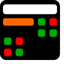

<div align = center>



<h1>Moadaly | مُعَدَّلِي</h1>

[](https://results.pre-commit.ci/latest/github/zer0-x/moadaly/main)

A **feature-rich** and **user friendly** [Linux](https://en.wikipedia.org/wiki/Linux) [GUI](https://en.wikipedia.org/wiki/Graphical_user_interface) desktop application for calculating the [GPA](https://en.wikipedia.org/wiki/Grade_point_average) and other related stuff, for every student.

---

[<kbd><br><b>Install</b><br><br></kbd>](#installation)
[<kbd><br><b>Screenshots</b><br><br></kbd>](#screenshots)
[<kbd><br><b>Contribute</b><br><br></kbd>](CONTRIBUTING.md)
[<kbd><br><b>Packaging</b><br><br></kbd>](PACKAGING.md)
[<kbd><br><b>Q&A</b><br><br></kbd>](#qa)

---

<br>

</div>

## Features
- 🧾 Free software under the [GPL-3.0](https://www.gnu.org/licenses/gpl-3.0.html) licence.
- 🗃️ Create multible profiles and switch between them in the fly, to manage multible separate CGPAs.
- 💾 All your data are saved localy, so you can always go back and modify them as you progrees in your studies.
- 📤 Export & 📥 Import, so you can easly transform data to another device or create a backup. `(import functionality is not yet implemented)`
- 💯 Every known grading or calculating system is supported. `(only few are implemented for now)`
- 🧮 A dynamic grades panel for semesters and ther courses.
- 🧰 Some extra tools thet may help you in your calculation. `(Only one tool is avialable, yet)`
- 📊 Some charts to make you understand your grades better. `(Not yet implemented)`
- 🖨️ PDF reports. `(Not yet implemented)`


## Installation
### Flatpak
Not available yet...
### AppImage
Not available yet...
### AUR
Not available yet...
### From the git repo <sup>`(Not recomended)`</sup>
1. Clone the repo from github and cd to it
```shell
git clone https://github.com/zer0-x/moadaly.git
cd modaly
```
2. Use the `setup.py` file to install it
```shell
python3 setup.py install
```
> You can create a virtual environment before that if you wanted.
3. Now it should be in your path. Just type `moadaly` to run the GUI
```shell
moadaly
```

# Screenshots


<sub>The theme might be differant depending on your desktop environment.</sub>

## Troubleshooting
- If you recently updated the PySide6 moudule from pip and you got some issues that prevent the app from starting, try running:
```shell
python3 -m pip install --force-reinstall --no-cache-dir PySide6
```

- The application is using Qt6 so it might not be theamed as your system, since it is not supported by a lot of themes. There is no sulotion other then wating for the support.

## Q&A

Q: What does `Moadaly` mean?
- It is an Arabic word `مُعَدَّلِي` that could be translated to `My GPA` in english.
